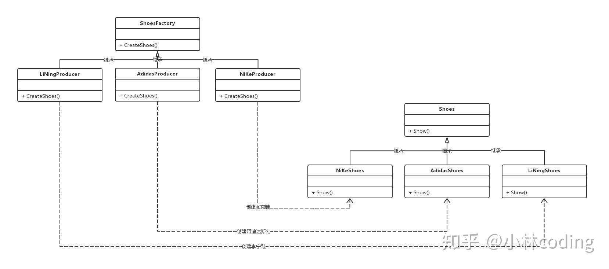

# 工厂模式UML图

## 工厂方法模式的结构组成：

1. 抽象工厂类：工厂方法模式的核心类，提供创建具体产品的接口，由具体工厂类实现。

2. 具体工厂类：继承于抽象工厂，实现创建对应具体产品对象的方式。

3. 抽象产品类：它是具体产品继承的父类（基类）。

4. 具体产品类：具体工厂所创建的对象，就是此类。

## 工厂方法模式的特点：

* 工厂方法模式抽象出了工厂类，提供创建具体产品的接口，交由子类去实现。
* 工厂方法模式的应用并不只是为了封装具体产品对象的创建，而是要把具体产品对象的创建放到具体工厂类实现。
## 工厂方法模式的缺陷：

* 每新增一个产品，就需要增加一个对应的产品的具体工厂类。相比简单工厂模式而言，工厂方法模式需要更多的类定义。
一条生产线只能一个产品。
## 工厂方法模式的代码：

* ShoesFactory抽象工厂类，提供了创建具体鞋子产品的纯虚函数。

* NiKeProducer、AdidasProducer、LiNingProducer`具体工厂类，继承持续工厂类，实现对应具体鞋子产品对象的创建。

___

在C++中，当你有一个类层次结构，并且你打算通过基类指针来处理派生类对象时，通常需要在基类中声明一个虚析构函数。这样做是为了确保当通过基类指针删除派生类对象时，能够调用正确的析构函数，从而避免资源泄露。

在您给出的代码中，`ShoesFactory` 是一个抽象类，因为它有一个纯虚函数 `CreateShoes`。同时，它还声明了一个虚析构函数。这是一个好的做法，因为它允许派生类的析构函数在删除基类指针时被正确调用。

以下是如何正确实现虚析构函数的例子：

```cpp
class ShoesFactory {
public:
    virtual Shoes *CreateShoes(SHOES_TYPE type) = 0; // 纯虚函数，需要在派生类中实现

    virtual ~ShoesFactory() {
        // 在这里执行基类的清理工作
        // 派生类的析构函数会在这个虚析构函数被调用后自动调用
    }
};
```

当你有一个指向 `ShoesFactory` 的指针，它实际上指向一个派生类对象，比如 `NikeShoesFactory`，并且你通过这个指针删除对象：

```cpp
ShoesFactory* factory = new NikeShoesFactory();
// ... 使用 factory
delete factory; // 这里会首先调用 NikeShoesFactory 的析构函数，然后是 ShoesFactory 的析构函数
```

如果 `ShoesFactory` 没有虚析构函数，那么 `delete factory;` 只会调用 `ShoesFactory` 的析构函数，而不会调用 `NikeShoesFactory` 的析构函数。这可能会导致派生类分配的资源没有被释放，从而引起内存泄露。

请注意，即使基类的析构函数不做任何事情，它仍然应该被声明为虚函数，如果你打算通过基类指针来删除对象。这是多态使用中的一个重要规则。