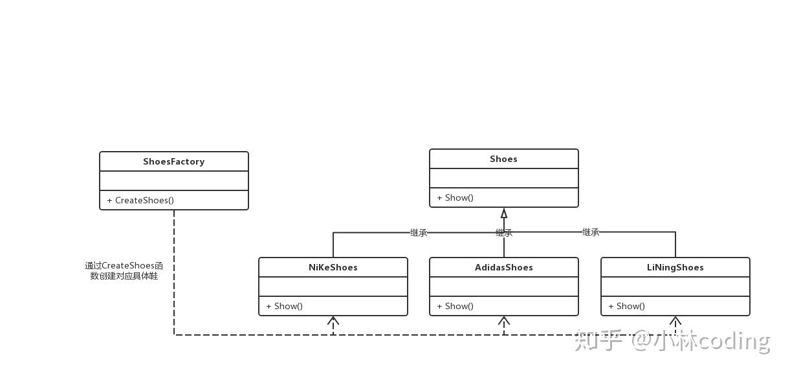

# 简单工厂模式UML图

## 简单工厂模式的结构组成：

1. 工厂类：工厂模式的核心类，会定义一个用于创建指定的具体实例对象的接口。

2. 抽象产品类：是具体产品类的继承的父类或实现的接口。

3. 具体产品类：工厂类所创建的对象就是此具体产品实例。

## 简单工厂模式的特点：

工厂类封装了创建具体产品对象的函数。

## 简单工厂模式的缺陷：

扩展性非常差，新增产品的时候，需要去修改工厂类。

## 简单工厂模式的代码：

Shoes为鞋子的抽象类（基类），接口函数为Show()，用于显示鞋子广告。

NiKeShoes、AdidasShoes、LiNingShoes为具体鞋子的类，分别是耐克、阿迪达斯和李宁鞋牌的鞋，它们都继承于Shoes抽象类。